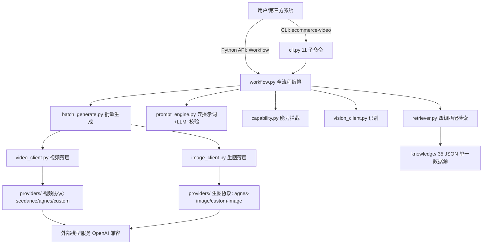

# ecommerce-video

**一张商品图 → 一条能投流的广告视频。**

ecommerce-video 是面向电商场景的 AI 视频生产工作流：知识库驱动的提示词引擎 + 开放模型接入 + 批量生成。它不是"输入描述出视频"的通用玩具，而是一条**从参考图到成片的完整流水线**——识别、写提示词、能力校验、批量生成、质检交付，每个环节都按真实的电商对客业务设计，可安装、可嵌入、可商用。

> 当前版本：v1.5.0（src 布局，`pip install` 可装；Python ≥ 3.9）

## 适合谁

- **电商运营 / 品牌方**：给商品图配专业广告视频，分镜到成片全流程
- **AI 视频创作者 / 代运营**：批量出片、多模型对比、确认单管理客户交付
- **开发者**：pip 安装即用，CLI 或 Python API 嵌入自有系统，自定义模型接入

## 为什么是它

| 痛点 | ecommerce-video 的解法 |
|------|------------------------|
| 提示词写不准，生成视频不像商品 | 14 品类知识库 + 每镜精准注入：材质/场景/灯光/运镜四级匹配，不堆提示词 |
| 换个模型就要改代码、重学接口 | 开放接入：OpenAI 兼容接口只改 `.env` 零代码接入；私有厂商 30-50 行写类注册即用 |
| 英文提示词风格飘、不像中国电商调性 | 全中文提示词三层规则（L1 锚定参考图 / L2 动态 / L3 材质），一致性优先 |
| 生成一半发现超出模型能力 | 能力感知拦截：参考图数/时长/分辨率/生图模式，入队前校验 |
| 医疗/药品/保健乱接单 | 合规红线表：无资质品类流程级拦截 |
| 客户确认流程一团乱 | 确认门 + 确认单（入场券）：单可追溯、交付有记录 |
| 想先看效果再决定 | 本地 mock 端到端验证 + 109 主测试 + 4 集成测试全绿，`kbcheck` 知识库 35/35 程序化校验 |

---

## 快速开始

```bash
# 1. 安装（二选一）
pip install ecommerce-video          # 方式一：PyPI / 私有源发布包
# 或解压发布包 zip 后：pip install .   # 方式二：源码包

# 2. 初始化数据库
ecommerce-video init

# 3. 配置 .env（复制 .env.example 为 .env，填入你的 API Key）
#    没有密钥也可先跑通无密钥环节：check / dry / validate / kbcheck

# 4. 配置自检（接单前必跑；缺失项会明确列出）
ecommerce-video check

# 5. 无密钥先体验：元提示词干跑 + jobs 校验 + 知识库校验
ecommerce-video dry demo_storyboard.json     # 不调 LLM，看元提示词怎么组装
ecommerce-video validate demo_jobs.json      # 规则校验（L1 锚定/全中文/负面词…）
ecommerce-video kbcheck                      # 知识库 35 文件 Schema 校验

# 6. 完整链路（以下命令需要真实 API Key）
ecommerce-video gen demo_storyboard.json -o jobs.json   # AI 写提示词（需 LLM Key）
ecommerce-video import jobs.json                         # 导入任务（job 需含 project/sku/category）
ecommerce-video confirm-all demo                        # 发放入场券（确认单全✓）
ecommerce-video run --limit 5                           # 批量生成（需真实 API Key）
ecommerce-video status                                  # 任务状态统计
```

> 提示：`demo_jobs.json` 是纯提示词样例（只含 shot_no/prompt/negative_prompt），可直接 `validate`；`import` 需要每条 job 含 `project`/`sku`/`category`，完整可导入样例见 `demo_jobs_full.json`。`gen` 输出的 jobs 也需补上这三个字段再导入。

## CLI 命令表

| 命令 | 用途 | 密钥 |
|------|------|------|
| `check` | 配置自检（复用 config.check_config + capability） | 无（缺失会提示） |
| `status` | 任务状态统计 | 无 |
| `init` | 初始化数据库 | 无 |
| `import <jobs.json>` | 导入任务（job 需含 project/sku/category） | 无 |
| `confirm <job_key>` | 发放入场券（确认单全✓，本地数据库操作） | 无 |
| `confirm-all <project>` | 项目内全部任务批量发放入场券 | 无 |
| `run [--limit N]` | 从队列取任务生成（串行，可多次跑） | **需真实 API Key**（缺失前置拦截） |
| `gen <sb.json> [-o jobs.json]` | AI 提示词生成（prompt_engine） | **需 LLM Key**（TEXT_LLM_API_KEY 或 VISION_API_KEY） |
| `dry <sb.json>` | 元提示词干跑（不调 LLM，调试用） | 无 |
| `validate <jobs.json>` | 校验生成的 jobs.json（规则检查） | 无 |
| `kbcheck [--strict] [<file>]` | 知识库 JSON Schema 校验（validate_kb） | 无 |

`ecommerce-video --help` 可随时查看（帮助为中文）。

## Python API 示例

```python
from ecommerce_video import Workflow

w = Workflow(project="projA", sku="sku1", category="clothing",
             material="缎面", type_name="tvc", provider="seedance-2.0")

w.check()                                        # 配置自检（接单前）
report = w.recognize(["refs/sku1_white.png"])    # 阶段1：识别参考图 → 合并报告（供人工确认）
sources = w.retrieve_sources([{"shot_no": 1, "scene": "大理石美术馆"}])   # 阶段2：按镜检索词源
result = w.generate_prompts(storyboard)          # 阶段3：LLM 生成提示词 → {"jobs": [...], "issues": [...]}
w.validate_against_capability(result["jobs"])    # 阶段4：模型能力拦截（空列表=通过）
w.generate(result["jobs"], version_count=2)      # 阶段5：入队批量生成
# 或用队列式流程：
# w.import_jobs("jobs.json") → w.confirm_all("projA") → w.run(limit=5)
w.stats()                                        # 任务/素材库统计
```

Workflow 公开方法（14 个，可用 `dir(Workflow)` 核实）：

`build_meta_prompt` / `check` / `confirm` / `confirm_all` / `generate` / `generate_prompts` / `import_jobs` / `init` / `recognize` / `retrieve_sources` / `run` / `stats` / `validate_against_capability` / `validate_prompts`

方法均有中文 docstring 与类型注解；确认门（识别报告/确认单）不内置强制，由调用方决定何时放行。

## 模型接入（三方式）

| 方式 | 适用 | 工作量 | 说明 |
|------|------|--------|------|
| **A. 配 custom（零代码）** | OpenAI 兼容 API（聚合平台/自建网关等） | 0 代码 | 只改 `.env`：`VIDEO_PROVIDER=custom` + `CUSTOM_API_KEY/BASE/MODEL`；生图同理 `IMAGE_PROVIDER=custom-image` + `IMAGE_API_KEY/BASE/MODEL/SIZE` |
| **B. 写 provider 类** | 非兼容厂商（可灵签名制、Runway、Vidu 等私有结构） | 30–50 行 | 实现协议方法（视频 `create_task`/`query_task`，生图 `generate`），`@register` / `@register_image` 注册即自动发现，不改核心代码 |
| **C. 用内置实现** | 已注册的 provider | 0 | 填 id 即用（见下） |

内置注册（视频查询用 `list_providers()`，生图查询用 `list_image_providers()`）：

- 视频（6 个注册名）：`agnes` / `agnes-video` / `custom` / `seedance` / `seedance-2.0` / `seedance-2.5`
- 生图（5 个注册名）：`agnes` / `agnes-image` / `custom-image` / `openai` / `seedance`

`knowledge/models.json` 还登记了 kling / jimeng / runway / vidu 等厂商的能力参数（`verified=false`，接入时需按官方文档复核）；默认推荐 seedance-2.0。完整接入步骤、mock 实测记录见 **`docs/PROVIDERS.md`**。

## 知识库

- **单一数据源 = 包内**：`src/ecommerce_video/knowledge/`（随 wheel 打包，`pip install` 后开箱即用）
- **内容**：35 个 JSON（21 个顶层 + 14 个品类 profile）、`schema/` 9 个 Schema、`raw/aishotstudio/` 30 篇素材、`profiles/` 14 个品类档案
- **14 个品类**：clothing 服装 / beauty 美妆护肤 / food 食品 / digital3c 3C数码 / home 家居 / shoes 鞋靴 / bags 箱包 / accessories 配饰 / personalcare 个护 / baby 母婴 / sports 运动户外 / pet 宠物 / auto 汽车用品 / jewelry 珠宝钟表
- **覆盖方式**：环境变量 `KNOWLEDGE_DIR` 指向自建知识库即可覆盖包内默认（优先级：`KNOWLEDGE_DIR` > 包内 knowledge/ > 项目根 knowledge/）
- **程序化校验**：`ecommerce-video kbcheck` 对 35 个 JSON 逐一做 Schema 校验（35/35 通过）；改知识库后必须重跑

## 测试

```bash
# 主套件 78 用例（tests/ 下 5 个文件，零第三方依赖，直接 unittest 跑）
python -m unittest tests.test_workflow tests.test_retriever tests.test_providers tests.test_capability tests.test_kb_integrity -v

# 开放接入集成套件 4 用例（独立跑；本地 mock server 起在 127.0.0.1）
python -m unittest tests.test_custom_integration -v
```

> ⚠️ 两套不能混跑：集成套件会改写全局环境变量，主套件在 import 时读配置。先跑主套件，再单独跑集成套件。

## 目录结构

```
src/ecommerce_video/          # 包主体（src 布局）
├── workflow.py               # Python API 入口（Workflow 类）
├── cli.py                    # 统一命令行（ecommerce-video 11 子命令）
├── retriever.py              # 检索层（每镜精准词源，四级匹配）
├── capability.py             # 模型能力感知（生成前拦截超限）
├── prompt_engine.py          # 元提示词组装 + LLM 调用 + 校验
├── providers/                # 视频协议（seedance/agnes/custom）+ 生图协议（agnes-image/custom-image）+ base.py
├── image_client.py           # 生图薄层
├── video_client.py           # 视频薄层（create_task/poll/download）
├── vision_client.py          # 识别（OpenAI 兼容）
├── db.py / config.py / logging_utils.py / validate_kb.py / batch_generate.py
├── knowledge/                # 知识库（35 JSON + schema/ + raw/ + profiles/）← 单一数据源
tests/                        # 78 主套件 + 4 集成套件（mock server）
docs/                         # PROVIDERS.md（模型接入）/ ARCHITECTURE.md（架构）
data/                         # 任务数据库（自动生成，SQLite）
output/                       # 生成产物（视频/分镜JSON/确认单）
```

## 文档索引

| 文档 | 内容 |
|------|------|
| `INSTALL.md` | 安装、快速开始、换模型、FAQ、升级 |
| `CONFIG.md` | .env 环境变量配置规范 |
| `ASSETS.md` | 素材库管理规范（资产目录/命名/质检/交付） |
| `docs/PROVIDERS.md` | 模型接入指南（三方式 + mock 实测） |
| `docs/ARCHITECTURE.md` | 架构图（分层/流程骨架/检索匹配） |
| `01-面料×场景×光线对照表.md` | 面料质感与场景光线组合速查 |
| `02-分镜表模板.md` | 分镜表填写模板 |
| `03-视频提示词问答与细节确认逻辑.md` | 提示词问答与细节确认逻辑规则 |
| `04-客户问答话术与确认流程.md` | 对客话术与确认流程 |
| `05-电商广告视频类型库.md` | 广告视频类型库 |
| `06-品类合规红线表.md` | 合规红线（拦截清单） |
| `07-服装广告镜头语言速查表.md` | 镜头语言速查 |

## 架构



完整架构图（总体分层 / 流程骨架 A0→G / 检索四级匹配）见 **`docs/ARCHITECTURE.md`**。

## 核心方法论（已定稿）

1. **双通道信息模型**：参考图=静态外观，提示词=动态——外观细节写多了与参考图冲突导致变形
2. **提示词三层规则**：L1 锚定（与参考图完全一致）→ L2 动态层（主力）→ L3 材质一句话锚定
3. **提示词七要素**：服装/模特/场景/灯光/镜头/运镜/动作+材质动态 + 画质收尾
4. **场景=产品第二层皮肤**：色彩呼应/材质对话/光线自洽/叙事场景/风格DNA
5. **全部中文提示词**（用户硬性要求）
6. **每镜精准注入**（战役1）：retriever 按需加载+四级匹配（材质/精确/别名/tags），不堆提示词

## 开源协议与贡献

- 协议：MIT（见 `LICENSE`）
- 贡献指南：见 `CONTRIBUTING.md`（开发环境 / 测试纪律 / 代码风格 / PR 流程 / 知识库修改规范）
