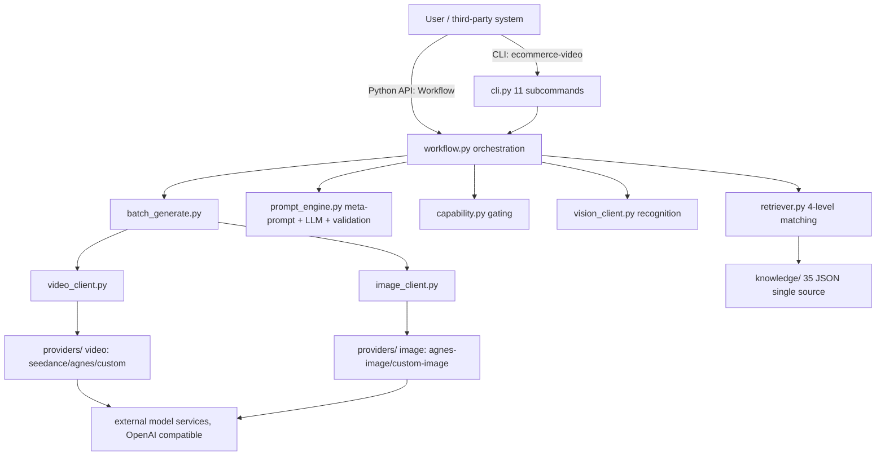

# ecommerce-video

An AI video generation workflow for e-commerce: knowledge-base-driven prompt engine + open model integration + batch generation.

**In one sentence:** a pip-installable Python package that turns "reference images → storyboard → Chinese prompts → batch video generation" into one pipeline. Prompts are injected per-shot from a curated knowledge base; model access is open — not bound to any single vendor.

> Current version: v1.5.0 (src layout, pip-installable; Python ≥ 3.9)

## Highlights

- **Open model integration — zero-code `custom` is the main path**: any OpenAI-compatible endpoint (self-hosted gateway, aggregator, etc.) connects via `.env` only, for video / image / LLM chains alike. Non-compatible vendors (signature-based APIs) need only a 30–50 line provider class (see `docs/PROVIDERS.md`)
- **Knowledge-base driven, 14 e-commerce categories**: 35 JSON files (category profiles, scene-light, aliases, compliance, models…) validated programmatically (`kbcheck` 35/35)
- **Per-shot precise injection, no prompt stuffing**: the retriever matches sources per shot (4-level matching: material / exact / alias / tags) instead of dumping 4000–6000 chars into every prompt
- **All-Chinese prompts**: 3-layer prompt rules (L1 anchor / L2 dynamics / L3 material) + 7 elements, strictly Chinese output
- **Batch generation + capability gating**: tasks exceeding the selected model's registered capabilities in `knowledge/models.json` (ref-image count / duration / resolution / image-to-video mode) are blocked before generation
- **Compliance red-line blocking**: categories without qualification (medical / pharma / health products) are refused by the workflow (`knowledge/compliance.json`)
- **Test baseline**: 78 main-suite tests + 4 open-access integration tests (local mock server, end-to-end), all green

## Quick Start

```bash
# 1. Install (either way)
pip install ecommerce-video          # way 1: published package
# or unzip the release package, then: pip install .   # way 2: source package

# 2. Initialize the database
ecommerce-video init

# 3. Configure .env (copy .env.example to .env and fill in your API keys)
#    No keys? You can still try the key-free steps: check / dry / validate / kbcheck

# 4. Config self-check (run before taking orders; missing items are listed)
ecommerce-video check

# 5. Key-free demo: meta-prompt dry run + jobs validation + KB validation
ecommerce-video dry demo_storyboard.json
ecommerce-video validate demo_jobs.json
ecommerce-video kbcheck

# 6. Full pipeline (commands below need real API keys)
ecommerce-video gen demo_storyboard.json -o jobs.json   # AI prompt generation (needs LLM key)
ecommerce-video import jobs.json                         # import jobs (each job needs project/sku/category)
ecommerce-video confirm-all demo                        # issue admission tickets
ecommerce-video run --limit 5                           # batch generation (needs a real API key)
ecommerce-video status                                  # status summary
```

> Note: `demo_jobs.json` is a prompt-only sample (shot_no/prompt/negative_prompt) — fine for `validate`; `import` requires each job to carry `project`/`sku`/`category` (importable sample: `demo_jobs_full.json`). Add those fields to `gen` output before importing.

## CLI Commands (11)

| Command | Purpose | Key needed |
|---------|---------|------------|
| `check` | Config self-check | no (missing items are reported) |
| `status` | Job status summary | no |
| `init` | Initialize database | no |
| `import <jobs.json>` | Import jobs | no |
| `confirm <job_key>` | Issue admission ticket (local DB op) | no |
| `confirm-all <project>` | Issue tickets for all jobs in a project | no |
| `run [--limit N]` | Generate from queue (serial, re-runnable) | **real API key** (blocked upfront if missing) |
| `gen <sb.json> [-o jobs.json]` | AI prompt generation | **LLM key** (TEXT_LLM_API_KEY or VISION_API_KEY) |
| `dry <sb.json>` | Meta-prompt dry run (no LLM call) | no |
| `validate <jobs.json>` | Rule-check a jobs.json | no |
| `kbcheck [--strict] [<file>]` | Validate knowledge-base JSON against schemas | no |

`ecommerce-video --help` always shows the Chinese help text.

## Python API

```python
from ecommerce_video import Workflow

w = Workflow(project="projA", sku="sku1", category="clothing",
             material="缎面", type_name="tvc", provider="seedance-2.0")

w.check()                                        # config self-check
report = w.recognize(["refs/sku1_white.png"])    # stage 1: recognize reference images
sources = w.retrieve_sources([{"shot_no": 1, "scene": "大理石美术馆"}])   # stage 2: per-shot source retrieval
result = w.generate_prompts(storyboard)          # stage 3: LLM prompts → {"jobs": [...], "issues": [...]}
w.validate_against_capability(result["jobs"])    # stage 4: capability gating (empty list = pass)
w.generate(result["jobs"], version_count=2)      # stage 5: enqueue & generate
# queue-style alternative: w.import_jobs("jobs.json") → w.confirm_all("projA") → w.run(limit=5)
w.stats()                                        # job / asset statistics
```

Public methods (14, verify with `dir(Workflow)`):

`build_meta_prompt` / `check` / `confirm` / `confirm_all` / `generate` / `generate_prompts` / `import_jobs` / `init` / `recognize` / `retrieve_sources` / `run` / `stats` / `validate_against_capability` / `validate_prompts`

All methods have Chinese docstrings and type hints. Confirmation gates (recognition report / confirmation sheet) are **not** enforced inside the API — the caller decides when to proceed.

## Model Integration (3 Ways)

| Way | Suitable for | Effort | Notes |
|-----|--------------|--------|-------|
| **A. `custom` (zero code)** | OpenAI-compatible APIs | 0 code | `.env` only: `VIDEO_PROVIDER=custom` + `CUSTOM_API_KEY/BASE/MODEL`; images: `IMAGE_PROVIDER=custom-image` + `IMAGE_API_KEY/BASE/MODEL/SIZE` |
| **B. Write a provider class** | Non-compatible vendors (Kling signature, Runway, Vidu…) | 30–50 lines | Implement the protocol (`create_task`/`query_task` for video, `generate` for image), register with `@register` / `@register_image` — no core changes |
| **C. Built-in providers** | Registered providers | 0 | Just set the provider id |

Registered providers (query with `list_providers()` for video, `list_image_providers()` for image):

- Video (6 names): `agnes` / `agnes-video` / `custom` / `seedance` / `seedance-2.0` / `seedance-2.5`
- Image (5 names): `agnes` / `agnes-image` / `custom-image` / `openai` / `seedance`

`knowledge/models.json` also registers capability params for kling / jimeng / runway / vidu (`verified=false` — re-check against official docs when integrating); default recommendation: seedance-2.0. Full guide + mock verification records: **`docs/PROVIDERS.md`**.

## Knowledge Base

- **Single source of truth = inside the package**: `src/ecommerce_video/knowledge/` (shipped inside the wheel, works right after `pip install`)
- **Contents**: 35 JSON files (21 top-level + 14 category profiles), `schema/` (9 schemas), `raw/aishotstudio/` (30 markdown sources), `profiles/` (14 category profiles)
- **14 categories**: clothing, beauty, food, digital3c, home, shoes, bags, accessories, personalcare, baby, sports, pet, auto, jewelry
- **Override**: set `KNOWLEDGE_DIR` to point at your own knowledge base (priority: `KNOWLEDGE_DIR` > package knowledge/ > project-root knowledge/)
- **Validation**: `ecommerce-video kbcheck` validates all 35 JSON files against schemas (35/35 pass); re-run it after any knowledge-base change

## Tests

```bash
# Main suite — 78 cases (5 files under tests/, no third-party deps)
python -m unittest tests.test_workflow tests.test_retriever tests.test_providers tests.test_capability tests.test_kb_integrity -v

# Open-access integration suite — 4 cases (run separately; local mock server on 127.0.0.1)
python -m unittest tests.test_custom_integration -v
```

> ⚠️ Do NOT run both suites together: the integration suite rewrites global env vars, while the main suite reads config at import time. Run the main suite first, then the integration suite separately.

## Directory Layout

```
src/ecommerce_video/          # package (src layout)
├── workflow.py               # Python API entry (Workflow)
├── cli.py                    # unified CLI (11 subcommands)
├── retriever.py              # retrieval layer (per-shot sources, 4-level matching)
├── capability.py             # model capability gating
├── prompt_engine.py          # meta-prompt assembly + LLM call + validation
├── providers/                # video protocol (seedance/agnes/custom) + image protocol (agnes-image/custom-image) + base.py
├── image_client.py           # image thin client
├── video_client.py           # video thin client (create_task/poll/download)
├── vision_client.py          # recognition (OpenAI compatible)
├── db.py / config.py / logging_utils.py / validate_kb.py / batch_generate.py
├── knowledge/                # knowledge base (35 JSON + schema/ + raw/ + profiles/) ← single source of truth
tests/                        # 78 main + 4 integration cases (mock server)
docs/                         # PROVIDERS.md (model access) / ARCHITECTURE.md
data/                         # SQLite task database (auto-created)
output/                       # generated artifacts (videos / storyboard JSON / confirm sheets)
```

## Docs Index

| Doc | Content |
|-----|---------|
| `INSTALL.md` | Install, quick start, switching models, FAQ, upgrade |
| `CONFIG.md` | `.env` configuration spec |
| `ASSETS.md` | Asset library conventions (directories / naming / QA / delivery) |
| `docs/PROVIDERS.md` | Model integration guide (3 ways + mock verification) |
| `docs/ARCHITECTURE.md` | Architecture diagrams (layers / A0→G flow / retrieval matching) |
| `01`–`07` numbered docs | Material×scene×light tables, storyboard template, prompt Q&A logic, client scripts, video type library, compliance red lines, camera language quick reference (Chinese) |

## Architecture



Full architecture diagrams (layered overview / A0→G flow skeleton / 4-level retrieval matching): **`docs/ARCHITECTURE.md`**.

## Core Methodology (finalized)

1. **Dual-channel information model**: reference image = static appearance, prompt = dynamics — over-describing appearance conflicts with the reference image and causes distortion
2. **3-layer prompt rules**: L1 anchor (identical to reference) → L2 dynamics (main body) → L3 material in one sentence
3. **7 prompt elements**: garment / model / scene / lighting / lens / camera move / action+material dynamics, closed with quality words
4. **Scene = product's second skin**: color echo / material dialogue / self-consistent light / narrative scene / style DNA
5. **All-Chinese prompts** (hard user requirement)
6. **Per-shot precise injection**: retriever loads on demand with 4-level matching (material/exact/alias/tags), no prompt stuffing

## License & Contributing

- License: MIT (see `LICENSE`)
- Contributing: see `CONTRIBUTING.md` (dev environment / test discipline / code style / PR flow / knowledge-base change rules)
