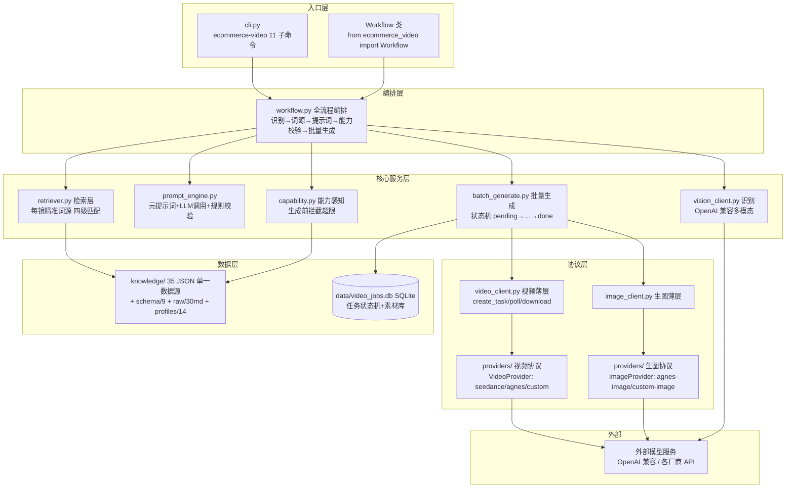
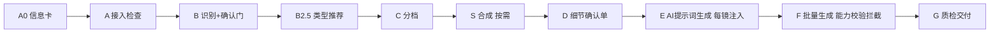
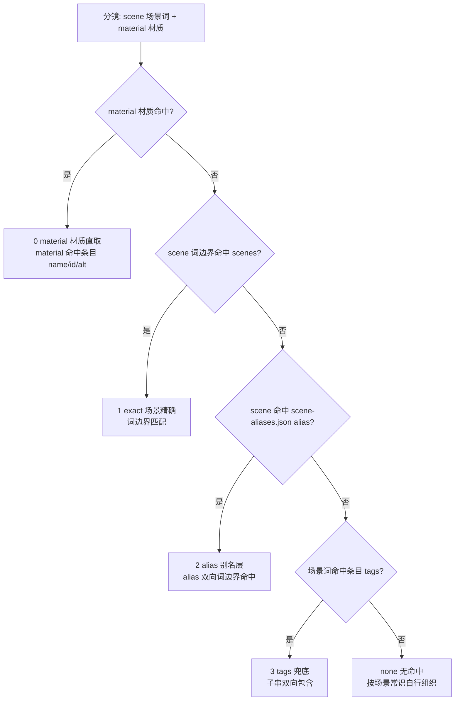
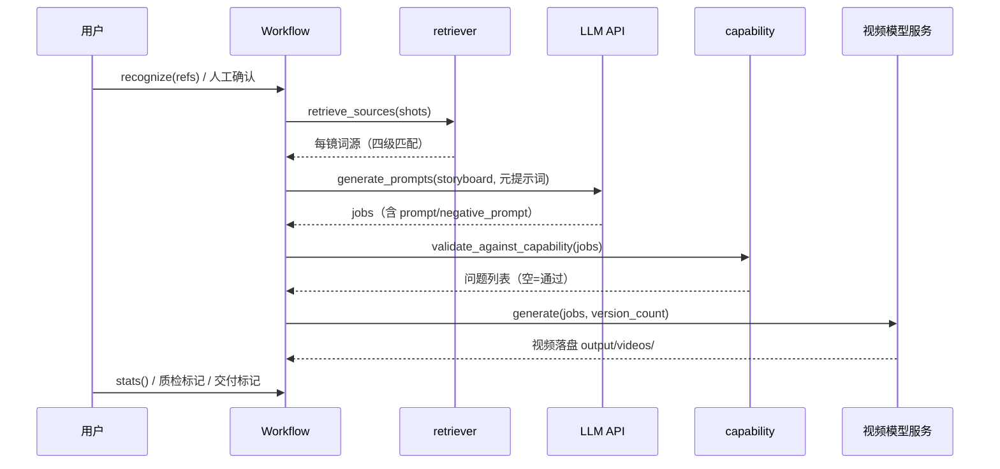

# 架构说明（ARCHITECTURE）

> 对应 README 架构一节；本文给出完整版：总体分层、流程骨架 A0→G、检索四级匹配。
> 版本：v1.5.0（src 布局，包名 ecommerce-video）

---

## 1. 总体架构（分层）



### ASCII 备用版

```
┌─ 入口层 ─────────────────────────────────────────────┐
│  CLI: ecommerce-video（11 子命令）                    │
│  API: from ecommerce_video import Workflow           │
└──────────────┬───────────────────────────────────────┘
               ▼
┌─ 编排层 ─────────────────────────────────────────────┐
│  workflow.py：识别→词源→提示词→能力校验→批量生成       │
└──────┬────────┬────────┬────────┬────────┬───────────┘
       ▼        ▼        ▼        ▼        ▼
   retriever  prompt_  capability  vision_  batch_
   .py 检索   engine.py  .py 拦截  client   generate.py
       │        │        │        │        │
       ▼        ▼        ▼        ▼        ▼
   knowledge/  LLM     models.json  外部识别  video_client/image_client
   35 JSON     调用      能力参数    API      （薄层）
                                                 │
                                                 ▼
                                     providers/（视频/生图协议）
                                                 │
                                                 ▼
                                     外部模型服务（OpenAI 兼容）
```

**模块职责**（与 `00-项目进度快照.md` 第四节一致）：

| 模块 | 职责 |
|------|------|
| `workflow.py` | Python API 入口（Workflow 类），整条流水线编排 |
| `cli.py` | 统一命令行（ecommerce-video 11 子命令），薄封装只做路由 |
| `retriever.py` | 检索层：按镜精准检索词源（四级匹配），每镜只注入本镜所需 |
| `capability.py` | 模型能力感知：按 models.json 在生成前拦截超限任务 |
| `prompt_engine.py` | 元提示词组装 + LLM 调用 + 规则校验（validate_jobs） |
| `providers/` | 视频协议（VideoProvider: seedance/agnes/custom）+ 生图协议（ImageProvider: agnes-image/custom-image）+ base.py |
| `image_client.py` | 生图薄层（对外 generate 不变） |
| `video_client.py` | 视频薄层（create_task/poll/download） |
| `vision_client.py` | 识别（OpenAI 兼容多模态） |
| `db.py / config.py / logging_utils.py / validate_kb.py` | 数据库 / 配置 / 日志 / 知识库校验 |
| `knowledge/` | 知识库（35 JSON + schema/ 9 + raw/ 30 + profiles/ 14）← 单一数据源 |

## 2. 流程骨架（A0 → G）



### ASCII 备用版

```
A0 信息卡 → A 接入检查 → B 识别+确认门 → B2.5 类型推荐 → C 分档
→ S 合成(按需) → D 细节确认单 → E AI提示词生成(每镜注入)
→ F 批量生成(能力校验拦截) → G 质检交付
```

流程要点：

- **A 接入检查**：接单前 `ecommerce-video check`（config.check_config + capability），防密钥省略导致 401/403
- **B 识别+确认门**：参考图逐张识别（vision_client）→ 合并报告 → **人工确认**；确认门由调用方放行，API 不强制
- **D 细节确认单**：客户确认单全 ✓ = 入场券（confirm / confirm-all），confirmed 才能入队
- **E 每镜注入**：retriever 按镜检索词源 → 元提示词（prompt_gen_template.md）→ LLM 生成 → validate_jobs 规则校验（L1 锚定/全中文/负面词红线）
- **F 能力校验拦截**：capability.validate_job 按模型能力（参考图数/时长/分辨率/生图模式）拦截超限
- **G 质检交付**：qa_result.json（qa_status: pending/qa_ok/qa_fail）+ deliver_package.json（delivered=1）

## 3. 检索四级匹配（retriever.py）

每镜提示词只注入本镜所需词源。匹配优先级从高到低：



### ASCII 备用版

```
分镜 scene/material
   │
   ├─ 命中 material 条目 name/id/alt ────────────► 0 material 材质直取（最高）
   ├─ scene 与条目 scenes 词边界匹配 ────────────► 1 exact 场景精确
   ├─ scene 命中 scene-aliases.json 的 alias ────► 2 alias 别名层
   ├─ 场景关键词命中条目 tags ───────────────────► 3 tags 兜底
   └─ 全无命中 ──────────────────────────────────► none（按场景常识自行组织）
```

规则细节（来自 retriever.py 契约）：

- 每镜命中来源写入 `matched[shot_no]`（`material|exact|alias|tags|none`），供调试
- **material 材质直取**：商品属性优先，即使场景不匹配也直取
- **exact 场景精确**：分镜 scene 与条目 scenes 做「词边界匹配」
- **alias 别名层**：scene 命中 `scene-aliases.json` 的 alias（词边界互相命中）；别名文件缺失时静默跳过，不抛异常
- **tags 兜底**：场景关键词命中条目 tags（子串双向包含）；无场景直接命中时的兜底
- 检索结果限幅注入：场景光线 ≤3 / 灯光 ≤3 / 运镜 ≤2 / 镜头 ≤2 / 动作·材质动态 ≤5 / 负面词 8–15——不堆提示词

## 4. 数据流（一次完整生成）



## 5. 关键设计决策

- **知识库单一数据源 = 包内**（`src/ecommerce_video/knowledge/`），随 wheel 打包；`KNOWLEDGE_DIR` 环境变量可覆盖（优先级：KNOWLEDGE_DIR > 包内 knowledge/ > 项目根 knowledge/）
- **开放接入不做固定厂商预置**：custom 零代码是主路径（80% 用户用 OpenAI 兼容）；可灵等签名制厂商按 docs/PROVIDERS.md 方式 B 接入
- **能力参数降级**：provider 在 models.json 查不到时按 custom 保守参数 + 风险标注，绝不崩流程
- **确认门不内置强制**：识别报告/确认单由调用方决定何时放行（正式流程建议：recognize → 人工确认 → generate_prompts → validate_against_capability → 人工确认 → generate）
- **CLI 行为零变化**：cli.py 只做 argparse 路由，不重写业务逻辑；输出/退出码与旧模块入口一致
